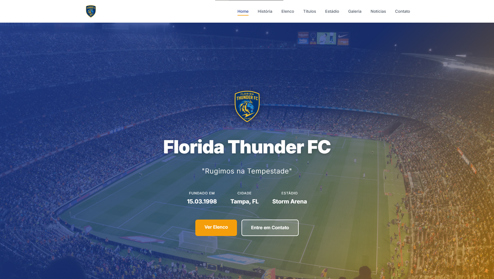

<div align="center">
  
  <h1>Florida Thunder FC ⚡🐯</h1>
  <p><em>"Rugimos na Tempestade"</em></p>
</div>

---

## 🌐 Projeto
Website conceitual criado para um **time de futebol fictício**, com foco em design **minimalista, moderno e responsivo**, simulando uma presença digital real de clube esportivo.

🔗 **Acesse o site ao vivo:**  
https://floridathunderfc.netlify.app

🔗 **Live Demo hospedado (deploy):**  
https://floridathunderfc.netlify.app

---

## ✨ Destaques do desenvolvimento
- UI clean e **sem distrações**
- **Hero section com vídeo de fundo em alta qualidade**
- Navegação fluida entre seções
- Layout **responsivo (desktop, tablet e mobile)**
- Seções organizadas: História, Elenco, Estádio, Galeria e Contato
- Estética esportiva premium com identidade visual coesa

---

## 🛠 Tecnologias utilizadas
- **HTML5**
- **CSS3** (Flexbox, Grid, animações, responsividade)
- **JavaScript** (interações e navegação dinâmica)
- **Netlify** (deploy e hospedagem)

---

## 📂 Estrutura do projeto
```bash
📦 Florida-Thunder-FC
 ┣ 📂 img
 ┃ ┣ 🎬 Videos e assets do site
 ┣ 📄 index.html
 ┣ 📄 styles.css
 ┣ 📄 script.js
 ┗ 📄 README.md
 
 ```
 ---
👨‍💻 Autor

Gabriel Cristino
📍 Fortaleza, Ceará — Brasil
📧 Email: gabriel.oficial.cristino@gmail.com
🔗 LinkedIn: linkedin.com/in/gabrielcristino1
🐙 GitHub: github.com/gban01

<div align="center"> <sub>Desenvolvido com 💙 e ⚡ por Gabriel Cristino</sub> </div> 
